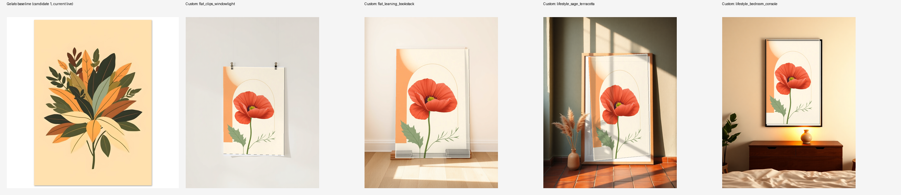

# Mockup scene prototype — findings & GL-2 recommendation (2026-07-22)

Branch: `proto/mockup-scene-prototype` (throwaway spike, off `master`).
Spec followed: `docs/SPEC_v4.10_addendum_custom_mockups.md` (custom mockup
pipeline design) + `docs/mockup_generator_prototype_prompt.md` (prototype
creative process). No Etsy/Gelato writes performed; one read call pulled the
baseline gallery.

## Test artwork & baseline

- Test artwork: **candidate 31** (`db/base_artwork/31.png`), "mid-century
  modern single bloom" — a round-3 Good design
  (`docs/2026-07-21-generation-quality-round3-validation-results.md`).
- Baseline pulled live via `pipeline.gelato_client.get_product()` (one GET,
  no write) against the one real published Gelato product in the DB
  (candidate 1's primary group, `gelato_product_id
  c0080773-5932-4987-b6ca-4adcc4f827ce`, live on the connected Etsy store).
  **Caveat:** baseline is a different design (candidate 1, "mid-century
  botanical leaves") than the artwork used for the custom mockups —
  candidate 31 has never been through Gelato create-from-template, and
  creating a product for it was out of scope (offline-authoring constraint).
  The baseline is still representative: it's literally what Gelato's
  default gallery looks like for this product line today (unframed premium
  matte poster), which is the thing being evaluated, not the specific art.
- **Baseline finding:** Gelato's current gallery is one flat product shot
  per size variant on a plain cream background — no room context, no
  styling, identical crop across all 4 sizes. This is the bar to beat.

## Phase 1 — style DNA

From the 11 reference images provided: a recurring "quiet editorial
interior" aesthetic — warm neutral walls (plaster, cream, dusty sage,
terracotta), raked warm directional light with soft cast shadows, sparse
single-prop styling (one vase, a book stack, a lamp), straight-on to
gentle-angle camera, medium-close framing. Two display conventions were
present in the references: **framed** (mat + wood/black frame — most of the
lifestyle shots) and **unframed/clipped** (the Tame Impala reference — raw
paper edge, binder clips).

Product reality: our line is **confirmed unframed** (CLAUDE.md). Owner
decision: **mix both** — flat/straight-on slots stay unframed (clipped or
leaning bare-edge, closest to what ships), lifestyle/angled slots use
framed staging for aspirational scale (standard POD convention, doesn't
require a "frame not included" disclaimer addition for this prototype since
it wasn't taken further than the spike).

## Phase 2 — scene generation

Model: **`black-forest-labs/flux-schnell`** (FLUX.1 [schnell], Apache-2.0,
commercial-use-safe — <https://github.com/black-forest-labs/flux/blob/main/model_licenses/LICENSE-FLUX1-schnell>).
No alternative model search was run beyond this — it's the guardrail's own
named default, capable of photorealistic interiors, and re-searching
Replicate's `/v1/search` (deprecated/404 in this account) wasn't worth the
extra spike time. Flagging per the hard rule anyway: no [dev] or other
license was used or considered.

5 scenes generated (portrait, `aspect_ratio=3:4`, `megapixels=1` — schnell's
resolution ceiling, upscale-on-keep deferred per the prototype prompt's own
allowance). Seeds + exact prompts: `scratch_mockup_proto/phase2_raw/manifest.json`.

| Scene | Tag | Kept? |
|---|---|---|
| `flat_clips_windowlight` | flat | yes |
| `flat_leaning_bookstack` | flat | yes |
| `lifestyle_sage_terracotta` | lifestyle | yes |
| `lifestyle_bedroom_console` | lifestyle | yes |
| `lifestyle_nook_monstera` | lifestyle | **no** — owner dropped it, foreground monstera leaf occluded ~40% of the aperture |

Two transient Replicate errors hit during the session (a "No adapter found
for model" on the first submit, and a 429 rate-limit from low account
credit) — both matched known, already-documented patterns
(`docs/2026-07-21-generation-quality-round3-validation-results.md`'s
environment note; the round-2 credit-backpressure pattern). Retry + request
spacing (11s between submits) resolved both; not a prototype defect.

## Phase 3 — throwaway compositor spike

`scripts/proto_mockup_compositor.py` — **explicitly throwaway**, marked as
such in its docstring. Pillow-only (no OpenCV in this environment): the
8-coefficient perspective transform is hand-solved with `numpy.linalg.solve`
and applied via `Image.transform(..., Image.PERSPECTIVE, ...)`, which is a
real homography warp, just without a cv2 dependency.

**Aperture detection:** the addendum's suggested approach (flood-fill from
center, detect the blank white insert) failed — the rendered "blank white"
poster and the rendered wall paint are only ~6-15 RGB units apart on these
scenes, well inside normal flood-fill color tolerance, so it floods straight
into the wall. Corners were hand-read from the images instead (visual
inspection, no pixel-probe tool), which is exactly the "show the quad, owner
corrects it" loop the addendum anticipates — except here *I* was the one
eyeballing and correcting, across 3 iterations for the hardest scene.

**Overlay:** derived automatically from the *already-rendered* lighting
across the blank poster insert (FLUX already baked a lighting gradient onto
the "blank" area — reused as a multiply/screen layer rather than hand-painted
per scene). A real shortcut; GL-5 would author these by hand.

**Result, 4 kept scenes, all composited with the real candidate-31 artwork:**

- `flat_clips_windowlight` — **clean.** Near axis-aligned quad, tight fit,
  shadow reads naturally. Production-plausible as-is.
- `lifestyle_bedroom_console` — **clean.** Also near axis-aligned (despite
  being staged as "lifestyle"), tight fit, warm lamp-glow overlay looks
  convincing.
- `flat_leaning_bookstack` — **visible seam.** A sliver of the original
  unwarped background shows past the artwork's right edge.
- `lifestyle_sage_terracotta` — **visible seam,** worse than the above. 3
  correction passes (including 2 numeric pixel-gradient probes to locate the
  frame/mat boundary precisely) narrowed it but didn't eliminate it.

Bundles committed at `assets/mockups/primary/portrait/<scene>/`
(`background.png`, `overlay.png`, `meta.json`, `preview.png`), format
matching Addendum §4. Top-level manifest: `assets/mockups/manifest.json`.

## Phase 4 — comparison

Left to right: Gelato baseline, then the 4 custom composites. Even the two
imperfect composites are a large step up from Gelato's flat cream-background
product shot — there's a room, light, and styling instead of nothing. The
two clean composites (`flat_clips_windowlight`,
`lifestyle_bedroom_console`) look genuinely close to production-ready.

## Honest read: realism vs. effort

The finding splits cleanly along **camera angle**, not along
flat-vs-lifestyle as labeled:

- **Near-frontal scenes** (small or no perspective skew between the
  aperture's top and bottom edges) — `flat_clips_windowlight` and
  `lifestyle_bedroom_console` — composite cleanly with hand-read corners on
  the first or second try. The homography math itself is correct (proven by
  these two); a mis-fit quad, not the approach, is what breaks a composite.
- **Steeply-angled/leaning scenes** — `flat_leaning_bookstack` and
  `lifestyle_sage_terracotta` — need corner precision this spike's tooling
  (eyeballing a chat-rendered image, no interactive pixel-probe) couldn't
  reliably deliver. This is a **solvable, bounded problem** — real
  corner-detection (proper OpenCV contour-finding instead of flood-fill on
  near-identical colors) or an interactive corner-picker in GL-5 would very
  plausibly close this gap — but it is real effort, not zero.

This is precisely the risk the Addendum's own §6 escape hatch names. It
doesn't say "self-hosting doesn't work" — it says the frontal/flat case is
easy (confirmed here) and the angled case is where effort concentrates
(confirmed here too).

## GL-2 recommendation: **go pre-launch, scoped**

Ship custom mockups pre-launch, but scope v1's *scene selection* to
near-frontal scenes only (both flat and lifestyle-styled) — the two clean
results in this spike are representative of what's reliably achievable
without further compositor investment. Reasoning:

1. Even the flawed composites clear Gelato's baseline by a wide margin — the
   bar is low, and "some styled scenes with a visible seam on 2 of them"
   still beats "flat product shot on cream" for conversion-relevant
   storefront imagery.
2. The failure mode (angled quad precision) is narrow, understood, and
   doesn't block launch if v1's curated scene set sticks to frontal/near-frontal
   staging — which still spans both the "flat" and "lifestyle" tag buckets
   per this spike's own evidence.
3. Steeper angled scenes are a **fast-follow (v1.1)**: either invest in
   GL-5's corner-detection tooling (bounded, solvable), or — if that proves
   a time-sink during GL-5 build-out — fall back to the documented **Dynamic
   Mockups escape hatch (Addendum §7)** for angled scenes specifically,
   while keeping the self-hosted compositor for frontal scenes. A hybrid
   is a legitimate outcome, not a failure of the self-host decision.

## Explicitly not done here (per scope)

- No 5x7/10x24 sets, no landscape orientation, no full 10-scene library —
  that's GL-6-proper, gated on this GL-2 call.
- No `pipeline/mockup_render.py`, no `mockup_templates` static config wiring,
  no `primary_mockup`/`group_mockup` rewiring, no `mockup_failed` retry path
  — that's GL-5.
- No Etsy/Gelato writes; the one Gelato read was a GET against an existing
  product.
